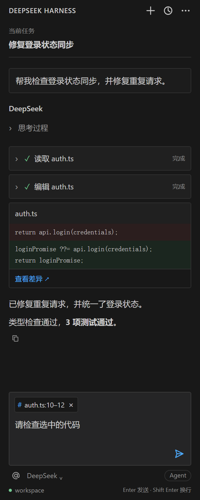

# DeepSeek Harness Native

[](https://github.com/ZhenyuePan/dsh-vscode-native/actions/workflows/ci.yml)
[](LICENSE)

A compact, **unofficial** VS Code frontend for [DeepSeek Harness](https://github.com/deepseek-ai/deepseek-harness).
原生侧栏交互，连接本地或 Remote SSH 主机上的 `dsh web`，不嵌入 DSH 网页。

> 社区实验项目，与 DeepSeek 官方无隶属关系。当前为开发预览，尚未上架 VS Code Marketplace。

## Preview



截图使用模拟对话；不包含真实用户代码。[浅色预览](docs/images/sidebar-light.png)。

## Features

- 流式回复、会话切换、模型选择、停止生成与断线重连。
- 编辑器选区自动显示文件名和行号；进入聊天框不会丢失引用。
- 显式添加文件或选区，可预览和移除，右键菜单可固定代码引用。
- Markdown 表格、列表、代码块复制，点击工作区文件链接跳转到代码行。
- 可折叠思考过程、工具调用和文件差异卡片。
- `ask_user_question` 直接显示交互选项，支持单选、多选、文字回答和取消；无需把答案作为普通聊天消息发送。
- 无头像紧凑布局，适配 VS Code 主题和窄侧栏。

## Install

1. 从 [Releases](https://github.com/ZhenyuePan/dsh-vscode-native/releases/latest) 下载 `.vsix`。
2. 在 VS Code 扩展视图的 `…` 菜单中选择 **Install from VSIX…**。
3. 重载窗口，打开侧边栏 **DeepSeek Harness**。

Remote SSH：先连接开发主机，在远程窗口安装；Node.js、DSH 配置及工作区文件都位于该主机。

### Prerequisites

- VS Code 1.95 或更新版本；开发和 CI 使用 Node.js 24 LTS、npm/npx。
- 按 [DSH 官方说明](https://github.com/deepseek-ai/deepseek-harness) 配好模型/认证，并先确认 `dsh` 本身可以完成一次对话。
- 首次启动需要访问 npm。插件按需执行 `npx -y @deepseek-ai/dsh@latest web --no-open --port 0`。
- Linux Remote SSH 已做真实后端测试；Windows/macOS 尚未完成端到端验证。
- 模型调用使用你的 DSH 配置，可能产生模型服务费用；插件不附送额度。

## Use

选中代码后，输入框上方会出现 `文件名:起始行–结束行` 胶囊。发送时附带这些选区及显式附件，
不自动附加整个文件；点击胶囊定位代码，点击 `×` 取消引用。底部 `@` 添加文件上下文。

顶部 `+` 新建会话，时钟按钮切换历史，省略号打开运行日志。Enter 发送，Shift+Enter 换行。
模型名称可点击切换；生成期间发送按钮变成停止。上翻对话后可点击“回到最新”。

### Known limitations

- 只加载 follow 的最近历史窗口，暂未实现向前分页。
- 审批暂需在支持的 DSH 客户端处理；本侧栏没有完整审批流程。
- Agent 标签只是当前工作方式标识，不是模式切换器。
- Diff 展示工具返回的变更片段，不保证是完整文件差异。
- 运行时使用 DSH `latest`，上游协议变化可能导致兼容问题。
- 目前通过 Release 手动安装更新；GitHub 的新提交不会自动更新你已安装的 VSIX。

## Develop

```bash
git clone https://github.com/ZhenyuePan/dsh-vscode-native.git
cd dsh-vscode-native
npm ci
npm run compile
npm test
npx playwright install chromium
npm run test:ui
npm run format
npm run package:vsix
```

编译时会复制 Markdown 渲染器及其许可证到 `media/`。打包时会自动重新编译。
`npm run format` 用 Prettier 统一代码格式，`npm run format:check` 只校验不写入。
Linux 安装浏览器依赖可用 `npx playwright install --with-deps chromium`。
UI 测试使用模拟数据，不需要模型密钥。可选的真实集成测试见 [贡献指南](CONTRIBUTING.md)。

## Releases and contributions

每次 main 提交和 Pull Request 自动运行 CI。维护者推送与版本匹配的标签（如 `v0.2.3`）后，
工作流会重新测试、打包并创建 GitHub Release，附上 VSIX 和 `SHA256SUMS.txt`。
**普通源码提交不发布新版；该工作流也不会向 VS Code 商店发布。**

欢迎 [报告问题](https://github.com/ZhenyuePan/dsh-vscode-native/issues) 和提交 PR。
请参阅 [CONTRIBUTING.md](CONTRIBUTING.md)、[更新记录](CHANGELOG.md) 和 [安全说明](SECURITY.md)。

## License and acknowledgements

[MIT](LICENSE)。Cline 提供了侧栏布局的设计参考，本项目独立实现界面与 DSH 通信，
不捆绑 Cline 引擎或品牌素材。第三方组件说明见 [THIRD_PARTY_NOTICES.md](THIRD_PARTY_NOTICES.md)。
